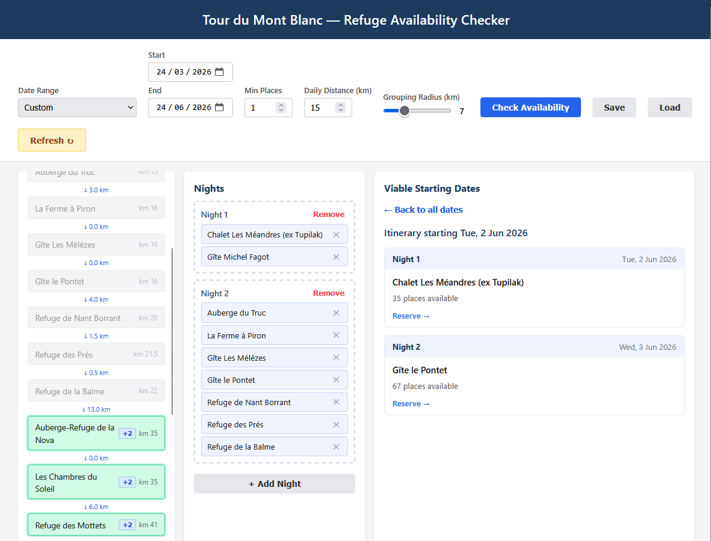

# Tour du Mont Blanc Refuge Planner

Check refuge (mountain hut) availability along the **Tour du Mont Blanc** hiking route. The app scrapes availability data from [montourdumontblanc.com](https://www.montourdumontblanc.com) and independent booking systems, then presents it through a CLI and a web-based itinerary planner.

The idea is that you put all of the refuges you would be willing to stay at on any given night, than the application tries to find a combination of refuges that have availability across your entire trip. This is especially useful for the popular summer months when places open up unpredictably.



## Features

- **Web itinerary planner** — drag-and-drop refuges into nightly groups, set a date range, and instantly see which start dates have availability across your entire trip
- **CLI availability checker** — check specific dates and refuges from the terminal with audio alerts when places open up
- **Trip planner** — save multi-day plans and monitor them for openings
- **Smart distance awareness** — refuges are ordered by km along the TMB, with daily distance visualization
- **Automatic caching** — rate-limited and cached so we don't flood the booking sites

## Prerequisites

You need **Python 3.11 or newer** and **pip** (Python's package installer).

### Don't have Python?

1. Go to [python.org/downloads](https://www.python.org/downloads/) and download the latest version (3.11+).
2. Run the installer. **Check the box that says "Add Python to PATH"** — this is important.
3. Open a new terminal (Command Prompt on Windows, Terminal on Mac/Linux) and verify it works:
   ```
   python --version
   ```
   You should see something like `Python 3.13.x`. If you get an error, try `python3 --version` instead.

> **Windows note:** If `python` isn't recognized after installing, close and reopen your terminal. If it still doesn't work, you may need to re-run the installer and check "Add Python to PATH."

## Installation

```bash
pip install git+https://github.com/Wyko/TMBRefugeChecker.git
```

Or if your system uses `python3`:
```bash
pip3 install git+https://github.com/Wyko/TMBRefugeChecker.git
```

After installation, the `montblanc` command is available in your terminal.

## Quick Start — Web UI

The easiest way to use the app is through the web interface:

```bash
montblanc web
```

This opens a browser at `http://127.0.0.1:8000` with a drag-and-drop itinerary planner where you can:

1. **Drag refuges** from the left panel into nightly groups on the right
2. **Pick a date range** (presets like "Summer 2026" or custom dates)
3. **Set min places** — only show dates with at least this many beds available
4. **Click Check** — the app finds all start dates where every night in your trip has availability
5. **Save/Load** your selections so you don't have to rebuild your itinerary each time

Options:
- `--port` — change the port (default: 8000)
- `--no-browser` — start the server without opening a browser

## CLI Usage

All commands start with `montblanc`. Run `montblanc --help` for full guidance.

### List all refuges

```bash
montblanc list
```

Shows every refuge with its ID and name:
```
Found 43 refuges:
32400:   Auberge Gîte Bon Abri
32406:   Auberge Mont-Blanc
32394:   Auberge des Glaciers
90001:   Refuge du Lac Blanc
90002:   Rifugio Elena
...
```

### Check availability

```bash
montblanc check <date> <refuges...>
```

Check one or more refuges on a specific date. Refuges can be partial names or IDs — the app fuzzy-matches them.

```bash
montblanc check 2026-07-01 "Bon Abri" Glaciers

# Also supports other date formats
montblanc check 2026.07.01 32400
montblanc check 01/07/2026 nova soleil
```

Options:
- `-m` / `--min-places` — alert threshold (default: 3). Beeps when a refuge has at least this many places.
- `-s` / `--silent` — suppress audio alerts

The command runs in a loop, rechecking every 5 minutes until you press Ctrl+C.

### Plan a trip

Build a multi-day plan and monitor all dates at once.

```bash
# Add nights to your plan
montblanc plan day 2026-07-03 "lac blanc"
montblanc plan day 2026-07-04 "Rifugio Elena"
montblanc plan day 2026-07-11 "de la Nova" Soleil

# View your plan
montblanc plan show

# Check availability for every night in the plan
montblanc plan check
```

Options for `plan day` / `plan check` / `plan show`:
- `-p` / `--path` — path to the plan file (default: `~/.montblanc/default_plan.json`)

Options for `plan check`:
- `-m` / `--min-places` — alert threshold (default: 3)
- `-s` / `--silent` — suppress audio alerts


## General Notes

This script has plenty of caching and rate-limiting built in so we don't flood the websites and make them angry. Don't mess with the rate limits, or this will end up broken _very_ quickly.

I haven't extensively checked the distance between huts that is shown in the web GUI; I pulled that data from another website. Use at your own risk, and submit a pull request in case that's not correct.
